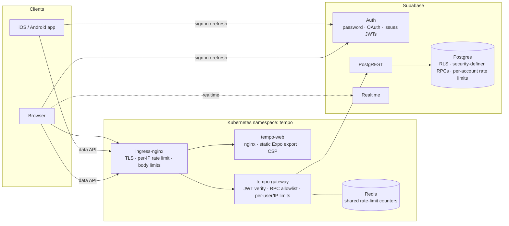

# Tempo security architecture

This document records the October 2026 security review, the controls added, the Supabase settings that must be configured by hand, and how to deploy Tempo to Kubernetes. It is a code and configuration review, not a penetration test.

## Architecture



Tempo has no application server of its own. Supabase is the backend: Supabase Auth issues the JWTs, and Postgres functions (RPCs) hold all business rules and authorization. The architecture keeps that design, because it already has the right security property: every rule is enforced next to the data. The additions below put layers in front of that core rather than replacing it.

| Layer | Where | What it enforces |
| --- | --- | --- |
| Edge | `deploy/k8s/base/ingress.yaml` | TLS only, HSTS, per-IP request and connection limits, body size limits |
| Web | `deploy/web/default.conf.template`, `vercel.json` | CSP, no framing, `nosniff`, Permissions-Policy (camera and location for this site only), GET/HEAD only |
| Gateway (optional) | `gateway/` | Verifies the Supabase JWT (signature, issuer, audience, expiry, role) before anything reaches Supabase; only the 13 RPCs and one table the app uses are reachable; per-IP and per-user rate limits shared through Redis; 22 MB body limit; PostgREST-shaped errors |
| Database (always on) | `supabase/20261003_security_hardening.sql` | Per-account rate limits on every write RPC, payload limits, recipient and visibility rules for messages, invite integrity, MFA enforcement, profile-photo validation |

**The database is the real enforcement point.** The Supabase URL and publishable key ship inside every app build, so anyone can call Supabase directly and skip both the app and the gateway. The gateway is defense in depth plus traffic shaping. It cannot replace the database checks, and none of them were moved out of the database.

### JWT

Supabase Auth already issues a signed JWT for every session, and supabase-js refreshes it automatically. Every RPC derives the caller from `auth.uid()`, so identity comes from the verified token, never from a request parameter. The gateway adds verification at the edge:

- **Asymmetric keys (current Supabase default).** Public keys are fetched from `<SUPABASE_URL>/auth/v1/.well-known/jwks.json` and cached. Accepted algorithms: ES256, RS256, EdDSA.
- **Legacy shared secret.** HS256 is accepted only when `SUPABASE_JWT_SECRET` is set. The two algorithm lists are disjoint, so a token cannot choose its own verification method. `alg: none`, forged, expired, wrong-issuer, wrong-audience and `anon`-role tokens are rejected (see `gateway/test/gateway.test.js`).

Auth and Realtime traffic goes straight to Supabase, not through the gateway. Supabase applies its auth rate limits per client IP. If auth went through the gateway, every user would share the gateway's IPs and quickly hit those limits.

### OAuth

`src/lib/oauth.ts` adds Supabase OAuth sign-in (Google, Apple, Microsoft, GitHub). **It is off by default.** The buttons appear only when `EXPO_PUBLIC_AUTH_PROVIDERS` lists providers, so until you configure them the app looks and works exactly as before.

- On web, sign-in is a full-page redirect back to the site, and the session is picked up from the URL as it is for email links today.
- On iOS and Android, sign-in uses the system auth browser (`expo-web-browser`) and returns to the `tempo://` scheme. This flow uses PKCE in a short-lived client: the returned code only works with a verifier held in that client's memory, and tokens placed directly in a redirect URL are ignored. Another app firing the deep link therefore cannot sign the user into a different account.
- An OAuth account has no "admin or worker" choice in its metadata, so the choice on the sign-up screen is saved on the device and written to the account after the first sign-in. After that it behaves exactly like a password account, and invitations are accepted the same way. OAuth emails are already verified by the provider.

To enable a provider:

1. Supabase Dashboard → Authentication → Sign In / Providers: enable it and enter the provider's client ID and secret.
2. Authentication → URL Configuration → Redirect URLs: add `https://tempo-workforce.vercel.app/**`, your Kubernetes web host (`https://tempo.example.com/**`), `tempo://**`, and for Expo Go development `exp://**`.
3. Set `EXPO_PUBLIC_AUTH_PROVIDERS=google,apple` for the build.
4. If Google is offered on iOS, App Store Guideline 4.8 requires Sign in with Apple as well.

A native build is required after this change because `expo-web-browser` was added.

### Two-step verification (MFA)

Any signed-in user can turn on authenticator-app (TOTP) verification in **Settings → Two-step verification**; it is recommended for admins. Accounts that do not turn it on work exactly as before.

- After the password (or OAuth) step, an account with a verified authenticator sees a code screen before the workspace loads (`src/ui/MfaChallenge.tsx`).
- **The database enforces it.** `tempo_require_mfa()` runs in every RPC. If the caller's account has a verified factor and the JWT's `aal` claim is not `aal2`, the request fails with HTTP 403. The invites RLS policy gets the same check through `tempo_is_admin`. A stolen password alone therefore gets no data, even by calling Supabase directly.
- Abandoned, never-verified enrolments do not lock an account.
- TOTP is enabled by default in Supabase Auth (Authentication → Multi-Factor). Recovery for someone who loses their authenticator: an operator removes the factor in Supabase Dashboard → Authentication → Users.

### Rate limits

| Operation | Database limit per account | Typical app use |
| --- | --- | --- |
| Save workspace (`tempo_save_snapshot`) | 120 / min | One per admin edit |
| Issue site QR | 60 / min | 2 / min per open display |
| Clock punch / break | 20 / min each | A 45 s or 15 s cooldown already applies |
| Time review | 240 / min | One per tap |
| Send message | 30 / min | One per message |
| Mark message / notification read | 1000 / 600 per min | Bursts when opening a chat |
| Accept invite / create workspace | 30 / 5 per min | Once per app start / once ever |
| Save invite | 30 / min | One per invite |

Over the limit, Postgres raises SQLSTATE `PT429`, PostgREST returns HTTP 429, and the app shows "Too many requests. Please wait a moment and try again." through its existing error display. Gateway defaults: 600 requests/min per user and 1200/min per IP (sites share Wi-Fi). Both can be changed in the ConfigMap. If Redis is down, the gateway lets requests through and logs a warning, and the database limits still apply. This keeps time clocks available.

## Findings

### Fixed in code

| Severity | Finding | Fix |
| --- | --- | --- |
| High | `tempo_send_message` accepted any recipient string and an unbounded body. A worker could message other workers directly, outside the conversations the app offers, or fill the table with megabyte-sized messages. | Recipients are limited to what the UI offers (admin → team or an existing worker; worker → team or admin). Body must be 1–4000 characters. Rate limited. |
| Medium | `tempo_mark_message_read` let any member mark any message in the workspace as read, including private admin↔worker messages meant for someone else. | Limited to messages the caller can see and did not send. |
| Medium | No rate limiting on any RPC. Self-service sign-up means anyone on the internet can create an admin account. | Per-account limits in the database, plus gateway and ingress limits. |
| Medium | Workspace state had no size limit. Any self-registered admin could store arbitrarily large JSON documents. | 1 MB limit for a new workspace, 20 MB for snapshots (hundreds of workers with photos). |
| Medium | The web app had no security headers. Pages, including the Site QR display, could be framed for clickjacking, and there was no CSP. | CSP, `frame-ancestors 'none'`, HSTS, `nosniff`, Referrer-Policy, Permissions-Policy and COOP in `vercel.json` and in the Kubernetes nginx config. The CSP allows the web QR scanner's WebAssembly from `fastly.jsdelivr.net`. |
| Low | An invite's `created_by` could be set to another user's id. Invites could point at workers that do not exist, and emails were not format-checked in the database. | The RLS check now requires `created_by = auth.uid()`. A trigger checks that the worker exists and is active. An email constraint was added `NOT VALID`, so existing rows are left untouched. |
| Low | The PostgREST root (`/rest/v1/`) exposes the schema description to any caller. | The gateway only forwards allowlisted RPCs and tables. |
| Low | The two `20260929_*` migrations sort alphabetically in the wrong order. | The order is documented below and tested in `supabase/tests/migrations.test.mjs`. |
| Medium | Admins had no second factor. One stolen password exposed every worker's pay data. | Opt-in authenticator-app MFA, enforced in every RPC once turned on. |
| Low | An admin could store an external URL as a worker photo, which would then load from workers' devices (IP tracking). | New or changed photos must be inline JPEG/PNG/WebP. Existing stored values are left alone. |
| Low | Raw database errors (constraint and permission names) were shown in the UI. | Only Tempo's own messages, rate-limit messages and gateway messages are shown. Anything else is replaced by a plain fallback. |
| Low | Native OAuth would have accepted tokens from any `tempo://` deep link during sign-in. | PKCE with a verifier held in memory. |

### Must be configured in Supabase (cannot be done from code)

| Priority | Setting | Why |
| --- | --- | --- |
| **Critical** (verified ON on 2026-10-03) | Authentication → Providers → Email → **Confirm email: ON** | `tempo_accept_invite` trusts `email_confirmed_at`. With auto-confirm on, anyone could register an invited worker's email address and take over that worker profile and pay data. The live project reports `mailer_autoconfirm: false`. Keep it that way. |
| High | Authentication → Policies: minimum password length 8 and **leaked password protection** on | The client already asks for 8 characters; this enforces it server-side. |
| High | Authentication → URL Configuration: list only the redirect URLs above | Stops email and OAuth links from redirecting to unlisted sites. |
| High | Authentication → Sessions: refresh token rotation on, reuse interval about 10 s; JWT expiry 3600 s or less | Limits how long a stolen token stays useful. |
| Medium | Project Settings → JWT Keys: migrate to asymmetric signing keys | The gateway can then verify tokens without holding a shared secret. |
| Medium | Authentication → Rate Limits: review sign-in, sign-up, OTP and email limits; consider CAPTCHA (requires client work) | Auth endpoints are not behind the gateway (see JWT). |
| Medium | Ask every admin to turn on two-step verification in Settings | Admins can see every worker's pay data. |

### Observed, intentionally unchanged

These were left alone because changing them would change how the app behaves.

- **Implicit auth flow on web.** Session tokens arrive in the URL fragment. Switching to PKCE would break email links opened on a different device or browser, and native-app emails that redirect to the website.
- **Realtime on `tempo_messages` delivers nothing.** The table has no SELECT grant, so chat updates through the 12-second refresh instead. This is safe as is. Enabling Realtime needs a SELECT RLS policy that mirrors `tempo_messages_snapshot`.
- **A live site QR is a bearer token for about 35 seconds** (already covered in `SHIP_READINESS.md`).
- **`npm audit --omit=dev` reports 20 advisories (5 high)** in Expo's build-time config tooling (`xcode` → `uuid`). They are not in the shipped app bundle. The suggested `--force` fix downgrades Expo, so update when Expo publishes compatible releases. The gateway has 0 advisories.
- **Web OAuth and email links still use the implicit flow** (see above), so a crafted link can sign a browser into the link creator's account (login CSRF). This was already the case for email links before this work.
- **QR display devices still need an admin session**, and **account deletion is not implemented.** Both need product and legal decisions (who can display codes; which time records must be retained), so they remain launch blockers in `SHIP_READINESS.md`.
- **`tests/pay.test.mjs` already failed before this work**, because `src/lib/data.ts` imports `./i18n` without an extension, which Node cannot resolve.

## Applying the database migration

Apply in this order in the Supabase SQL Editor (or with `psql`). Two files share a date, so do not rely on alphabetical order:

1. `20260929_tempo.sql`
2. `20260929_ship_ready.sql`
3. `20260930_paid_breaks.sql`
4. `20260930_punch_cooldown.sql`
5. `20261001_messages.sql`
6. `20261002_checkin_window.sql`
7. `20261003_security_hardening.sql` ← new

The new migration is a single transaction and is safe to run on a live project. It keeps existing data and redefines functions with the same signatures, so clients need no update.

## Deploying to Kubernetes

Prerequisites: ingress-nginx, cert-manager with a `letsencrypt` ClusterIssuer, a CNI that enforces NetworkPolicy (Calico, Cilium, or a cloud provider's), metrics-server (for the HPAs), and Kubernetes 1.30+ (`preStop.sleep`).

```bash
# 1. Images (EXPO_PUBLIC_* values are public and compiled into the bundle)
docker build -t ghcr.io/your-org/tempo-web:1.0.0 \
  --build-arg EXPO_PUBLIC_SUPABASE_URL=https://<ref>.supabase.co \
  --build-arg EXPO_PUBLIC_SUPABASE_PUBLISHABLE_KEY=sb_publishable_... \
  --build-arg EXPO_PUBLIC_API_GATEWAY_URL=https://api.tempo.example.com .
docker build -t ghcr.io/your-org/tempo-gateway:1.0.0 gateway
docker push ghcr.io/your-org/tempo-web:1.0.0 && docker push ghcr.io/your-org/tempo-gateway:1.0.0

# 2. Configure deploy/k8s/overlays/production/kustomization.yaml (hosts, registry, SUPABASE_URL, ALLOWED_ORIGINS)
cp deploy/k8s/overlays/production/secrets.env.example deploy/k8s/overlays/production/secrets.env
# set REDIS_PASSWORD=$(openssl rand -hex 32); SUPABASE_JWT_SECRET only for legacy-secret projects

# 3. Deploy
kubectl apply -k deploy/k8s/overlays/production
```

Hardening in the manifests:

- The namespace enforces Pod Security `restricted`.
- Every container runs as non-root with a read-only root filesystem, all capabilities dropped and seccomp `RuntimeDefault`.
- Service account tokens are not mounted.
- Network policies deny by default. The gateway may reach only Redis and public HTTPS (private IP ranges are blocked).
- Redis has a password, no persistence, and `CONFIG`/`FLUSHALL` disabled.
- The web and gateway deployments have HPAs and PDBs, spread across nodes, and roll out with zero downtime.

The gateway image is distroless (no shell).

`TRUST_PROXY_HOPS=1` assumes ingress-nginx is the only proxy in front of the gateway. If a cloud load balancer adds its own `X-Forwarded-For` entry, enable `use-forwarded-headers` in ingress-nginx, or the per-IP limit will count the load balancer instead of the client.

Native apps use the gateway when they are built with `EXPO_PUBLIC_API_GATEWAY_URL`. Leave it empty to keep calling Supabase directly. Either way, the database controls apply.

## Verifying

```bash
npm run test:db        # applies all migrations to in-process Postgres; full app flow + security boundaries
npm run test:gateway   # JWT, allowlist, CORS, rate limits, body limits, upstream failure
npx tsc --noEmit && npx expo lint && npx expo-doctor
```
